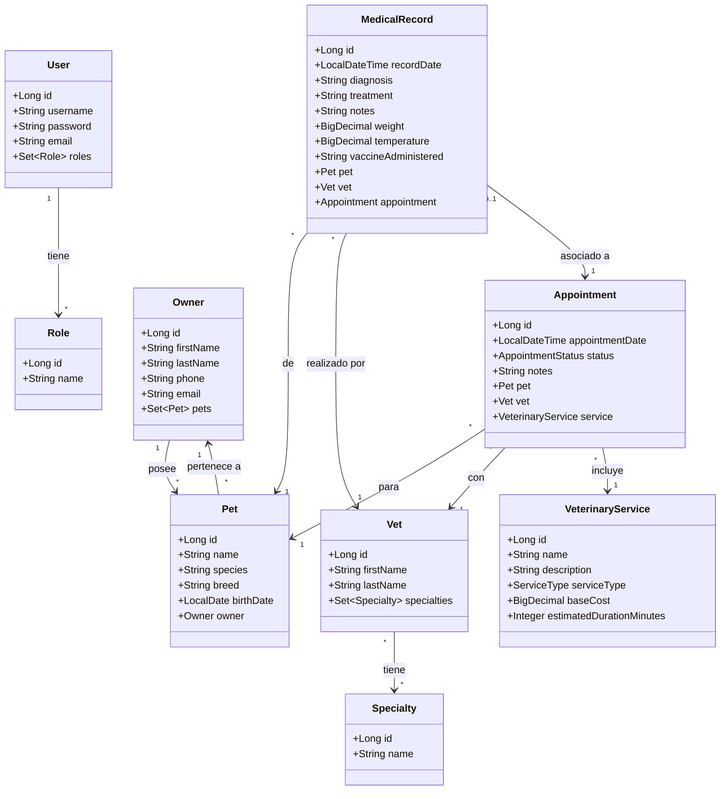

# 🏗️ Estructura del Proyecto y Modelo de Dominio

Este documento detalla la estructura de clases del proyecto, incluyendo un diagrama UML enfocado en el Historial Médico y descripciones detalladas de las entidades principales.

## 📊 Diagrama de Clases UML

El siguiente diagrama muestra las relaciones principales entre las entidades del dominio, destacando cómo el Historial Médico (`MedicalRecord`) se conecta con Mascotas, Veterinarios y Citas.

## 📝 Descripción de Clases

A continuación se describen las responsabilidades y atributos principales de cada clase del modelo de dominio.

### 1. Gestión de Usuarios y Seguridad

#### `User`
Representa a un usuario del sistema con acceso a la plataforma.
- **Responsabilidad**: Autenticación y autorización.
- **Atributos Clave**: `username`, `password` (encriptada), `email`.
- **Relaciones**: Tiene múltiples `Role`s.

#### `Role`
Define los permisos y niveles de acceso dentro del sistema.
- **Roles Comunes**: `ADMIN`, `VET` (Veterinario), `RECEPCIONISTA`, `USER` (Propietario).

### 2. Gestión de Clínica

#### `Owner` (Propietario)
Representa al cliente de la clínica, dueño de una o más mascotas.
- **Responsabilidad**: Almacenar información de contacto del cliente.
- **Atributos Clave**: `firstName`, `lastName`, `phone`, `email`, `address`.
- **Relaciones**: Un propietario puede tener múltiples `Pet`s.

#### `Pet` (Mascota)
Representa al paciente de la clínica.
- **Responsabilidad**: Almacenar información clínica básica del animal.
- **Atributos Clave**: `name`, `species` (Perro, Gato, etc.), `breed` (Raza), `birthDate`, `weight`.
- **Relaciones**: Pertenece a un `Owner`. Tiene múltiples `Appointment`s y `MedicalRecord`s.

#### `Vet` (Veterinario)
Representa al profesional médico que atiende a las mascotas.
- **Responsabilidad**: Realizar citas y crear historiales médicos.
- **Atributos Clave**: `firstName`, `lastName`, `licenseNumber`.
- **Relaciones**: Puede tener múltiples `Specialty`s. Está asociado a `Appointment`s y `MedicalRecord`s.

#### `Specialty` (Especialidad)
Define las áreas de especialización de un veterinario (ej. Cirugía, Cardiología).

### 3. Gestión Médica y Citas

#### `Appointment` (Cita)
Representa un turno agendado para un servicio veterinario.
- **Responsabilidad**: Gestionar la agenda y el flujo de trabajo de la clínica.
- **Atributos Clave**: `appointmentDate`, `status` (PENDING, CONFIRMED, COMPLETED, CANCELLED), `notes`.
- **Relaciones**: Vincula una `Pet` con un `Vet` para un `VeterinaryService`.

#### `VeterinaryService` (Servicio)
Define los servicios ofrecidos por la clínica.
- **Responsabilidad**: Catálogo de servicios con precios y duración estimada.
- **Atributos Clave**: `name`, `description`, `baseCost`, `estimatedDurationMinutes`.
- **Ejemplos**: Consulta General, Vacunación, Cirugía, Baño y Corte.

#### `MedicalRecord` (Historial Médico)
Representa el registro clínico de una visita o intervención.
- **Responsabilidad**: Documentar el estado de salud, diagnóstico y tratamiento de la mascota.
- **Atributos Clave**:
    - `diagnosis`: Diagnóstico médico.
    - `treatment`: Tratamiento recetado o realizado.
    - `notes`: Observaciones adicionales.
    - `weight` & `temperature`: Signos vitales al momento de la consulta.
    - `vaccineAdministered`: Registro de vacunas aplicadas (si aplica).
- **Relaciones**:
    - Pertenece a una `Pet`.
    - Es creado por un `Vet`.
    - Opcionalmente vinculado a una `Appointment` específica.

## 🔄 Flujo de Información (Ejemplo: Consulta Médica)

1.  El **Owner** solicita una **Appointment** para su **Pet**.
2.  La **Appointment** se asocia a un **Vet** y un **VeterinaryService**.
3.  El día de la cita, el **Vet** atiende a la **Pet**.
4.  El **Vet** crea un **MedicalRecord** registrando el diagnóstico, tratamiento, peso y vacunas.
5.  El **MedicalRecord** queda guardado en el historial de la **Pet** para futuras referencias.
